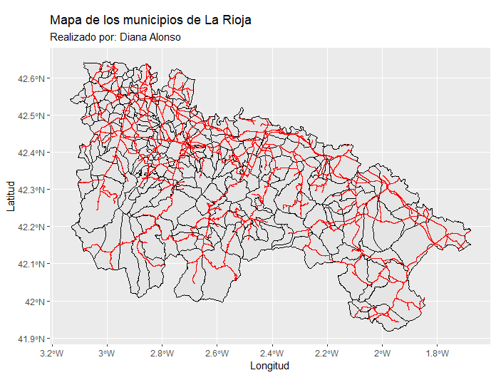

# Maps_in_R

Este repositorio presenta código que elabora distintos mapas utilizando la libreria de R, ggplot2.
Los archivos utilizados fueron de formato .jason y de acceso publico en:
https://github.com/iderioja

